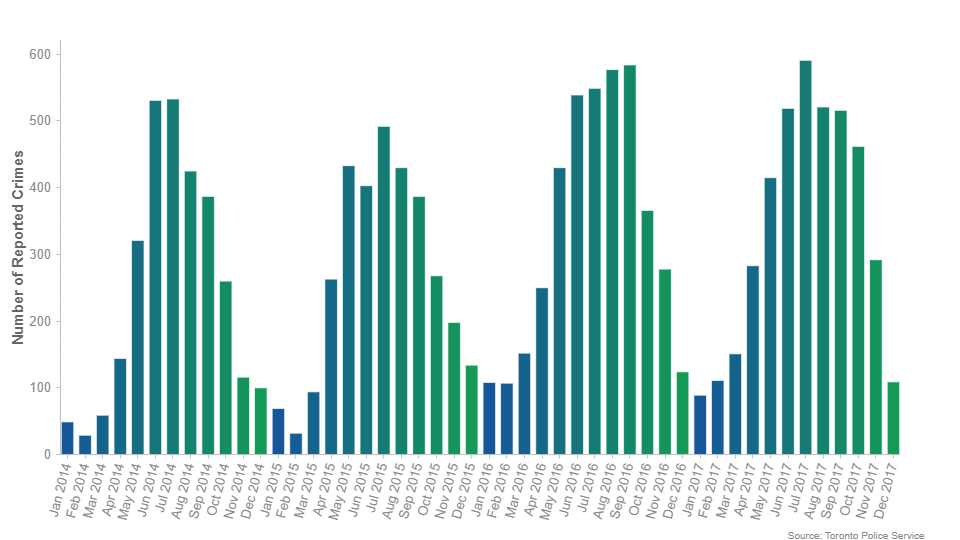

# Report

The Toronto Police Service publishes interesting datasets on their [public safety data portal](http://data.torontopolice.on.ca/) and I found a nice dataset on [bicycle-related crimes](http://data.torontopolice.on.ca/datasets/91af6347ff08458e9fa4e06b2acc4e1d_0) that was recently published and I thought it was interesting enough to write about. I have had a bike stolen in the city and it's a horrible feeling -- maybe this data can help you avoid having your bike stolen too.

Note: the data presented only reflects **reported** crimes, which may not reflect actual bicycle-related crime in the city

## Heat Maps
Think your bike is safe? Check the heat map to see where bike thefts are reported

  <button class="tablinks" onclick="generate_heatmap('crime')">All crimes</button>
  <button class="tablinks" onclick="generate_heatmap('theft')">Thefts</button>
  <button class="tablinks" onclick="generate_heatmap('be')">Breaking & Entering</button>
  <button class="tablinks" onclick="generate_heatmap('ebike')">E-Bike crimes</button>

## Yearly Data

The data shows that bicycle crimes have increased in 2016 and 2017 compared to 2014 and 2015:

Bicycle-related crimes (mostly theft) spike during the warmer months and slow down during the winter, which makes sense due to lower ridership:

