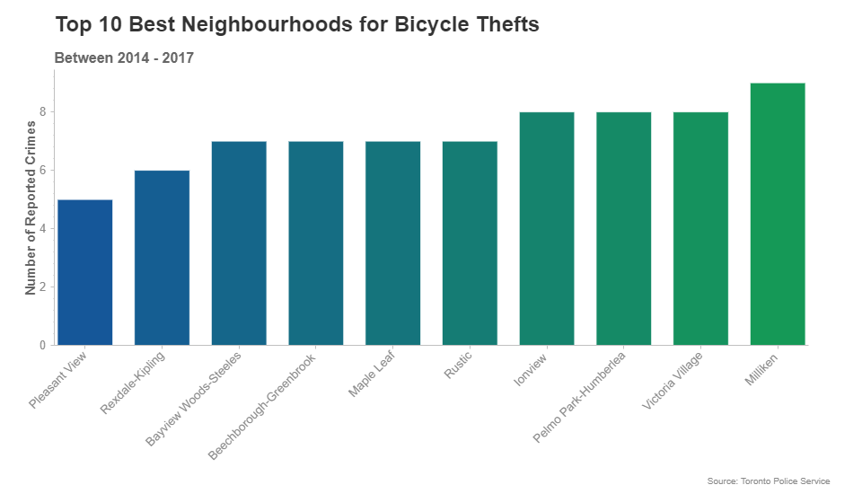
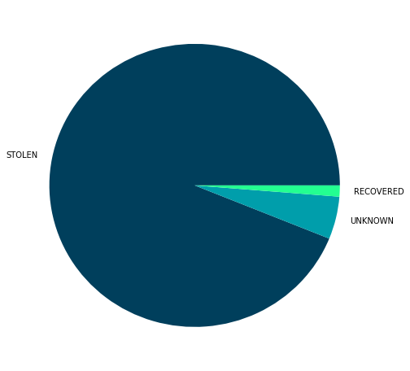

# Report

The Toronto Police Service publishes interesting datasets on their [public safety data portal](http://data.torontopolice.on.ca/) and I found a nice dataset on [bicycle-related crimes](http://data.torontopolice.on.ca/datasets/91af6347ff08458e9fa4e06b2acc4e1d_0) that was recently published and I thought it was interesting enough to write about. I have had a bike stolen in the city and it's a horrible feeling -- maybe this data can help you avoid having your bike stolen too.

Note: the data presented only reflects **reported** crimes, which may not reflect actual bicycle-related crime in the city

## Heat Maps
Think your bike is safe? Check the heat map to see where bike thefts are reported.

Unsurprisingly, the one place where there are no reported bicycle related crimes is the Bridle Path. 

  <button id="crime" class="tablinks" onclick="generate_heatmap('crime')">All crimes</button>
  <button id="theft" class="tablinks" onclick="generate_heatmap('theft')">Thefts</button>
  <button id="be" class="tablinks" onclick="generate_heatmap('be')">Breaking & Entering</button>
  <button id="ebike" class="tablinks" onclick="generate_heatmap('ebike')">E-Bike crimes</button>

Most thefts seem to occur on large streets and public places, but it doesn't mean your bike is safe on private property. About a third of thefts/crimes happen at houses and apartments/condos. 

*[Full list here](tables/full_locationtype.html)*

## Neighbourhoods
Each crime is listed with the neighbourhood of where the crime occurred! Waterfront Communities - The Island comes in first place with almost 1400 reported incidents over 4 years and Pleasant View comes in last with only **5**.

Here the top 10 neighbourhoods for most crimes and fewest crimes:

## Yearly Data

The data shows that the number of reported bicycle crimes have increased in 2016 and 2017 compared to 2014 and 2015. This could be due to the [increase in ridership levels throughout 2016 and 2017 due to better cycling infrastructure](https://www.cycleto.ca/news/major-increase-torontonians-biking-work-34-some-neighbourhoods). The unfortunate reality is that an increase in cyclists also means an increase in bicycle thefts.

Bicycle-related crimes (mostly theft) spike during the warmer months and slow down during the winter, which makes sense due to lower ridership:

## Prevention and Recovery

Do you know what your bicycle's serial number is? Or where to find it? Knowing the serial number to your bicycle is essential to recovering it if it gets stolen. Between 2014 and 2017 there were approximately 14,000 reported bicycle crimes and only around 1.27% of stolen bicycles were able to be recovered.

If you want to have a chance of getting your bike back after it's stolen, please register your bike with the Toronto Police [here](https://www.torontopolice.on.ca/bike/). Your serial number can typically be found on the bottom of your bike, under the [bottom bracket shell](https://www.google.ca/search?q=bottom+bracket+shell). Hopefully Toronto might get something like [Project 529](https://project529.com/garage) where victims can post an alert to fellow cyclists to look out for stolen bikes.
